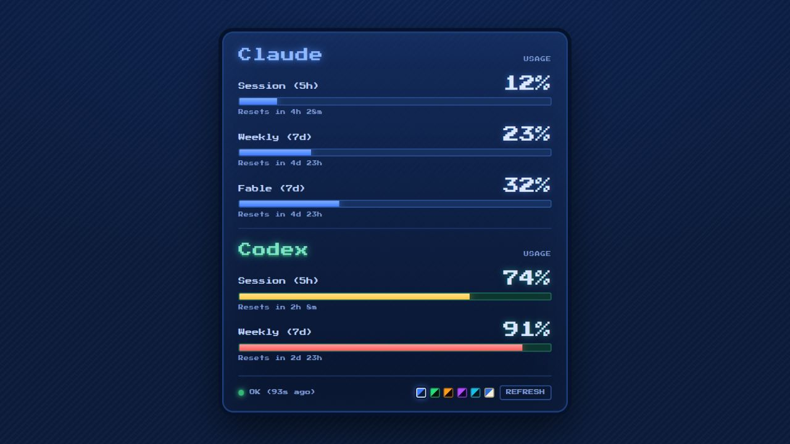

# AI Usage Web

[](https://github.com/richardrhg/ai-usage-web/actions/workflows/ci.yml)
[](LICENSE)



本機版的「Claude + Codex 用量儀表板」。在自己的電腦上跑，分別去問 Anthropic 和 OpenAI
目前的用量，把 5 小時 / 每週的額度畫成復古像素風網頁。

- 只用 Python 標準函式庫，**不需要 `pip install` 任何東西**
- 憑證自動偵測，通常什麼都不用設
- 六組配色可以隨時切換，選過的記在瀏覽器裡

## 需求

- Python 3.8+
- 想看 Claude 用量 → 裝好 [Claude Code](https://claude.com/claude-code) 並跑過一次 `claude` 登入
- 想看 Codex 用量 → 裝好 Codex CLI 並跑過一次 `codex` 登入

## 用法

```bash
python claude_usage_web.py                  # 兩邊都抓，開 http://127.0.0.1:8787
python claude_usage_web.py --demo           # 用假資料看畫面，不打任何 API
python claude_usage_web.py --only claude    # 只顯示 Claude
python claude_usage_web.py --only codex     # 只顯示 Codex
python claude_usage_web.py --port 9000 --interval 60
python claude_usage_web.py --theme amber    # 指定預設配色
```

| 參數 | 預設 | 說明 |
| --- | --- | --- |
| `--host` | `127.0.0.1` | 預設只綁本機。想給同網段其他裝置看再改 `0.0.0.0` |
| `--port` | `8787` | 網頁埠號 |
| `--interval` | `120` | 輪詢秒數 |
| `--only` | `both` | `both` / `claude` / `codex` |
| `--theme` | `midnight` | 開啟時的預設配色（瀏覽器記過的選擇優先） |
| `--demo` | — | 用假資料，不打 API |
| `--claude-token` / `--codex-token` | — | 手動指定 token，蓋過自動偵測 |

## 配色

網頁右下角六顆色票可以直接點，或按 <kbd>T</kbd> 循環切換：

`midnight` · `phosphor` · `amber` · `synthwave` · `ice` · `paper`

要加新主題：在 `PAGE` 的 CSS 補一段 `[data-theme="xxx"]`、`PAGE` 的 JS `THEMES` 陣列補一行，
再把 id 加進 `THEME_IDS`。

## 憑證

兩邊都是自動偵測，照下面的順序找：

**Claude**

1. `CLAUDE_CODE_OAUTH_TOKEN` 環境變數
2. `~/.claude/.credentials.json`
3. macOS Keychain（`Claude Code-credentials`）

**Codex**

1. `CODEX_ACCESS_TOKEN` 環境變數
2. `~/.codex/auth.json`

Token 每次輪詢都會重讀，CLI 換發之後會自動跟上。程式本身不會把任何憑證寫進檔案或送去別的地方，
只拿來呼叫官方端點。

### Token 過期

兩邊的 access token 都有效期（Claude 大約幾小時到一天）。這支程式**只讀不換發** —— 換發是 CLI
在用的時候才會做的事。所以如果隔一陣子沒開過 CLI，token 過期後對應那一欄就會變成錯誤。

解法是跑一下 CLI 讓它換發：

```bash
claude          # 或 codex
```

換發完不用重開儀表板，下一次輪詢就會自己跟上。

用 `--claude-token` / `--codex-token` 手動指定的話沒有這個自動跟上的機制 —— 那組字串是寫死的，
過期就得自己換。長期跑建議讓它走自動偵測。

## 說明

- Claude 那邊是送一個 `max_tokens: 1` 的極小請求，讀回應 header 裡的
  `anthropic-ratelimit-unified-*-utilization` 來取得用量。
- Codex 那邊打的是 Codex CLI 自己在用的 `https://chatgpt.com/backend-api/wham/usage`，
  OpenAI 沒有正式公開文件，**有可能會變**。

## 測試

測試不會讀取本機憑證，也不會呼叫任何外部 API：

```bash
python -m unittest discover -s tests -v
```

## License

[MIT](LICENSE)
